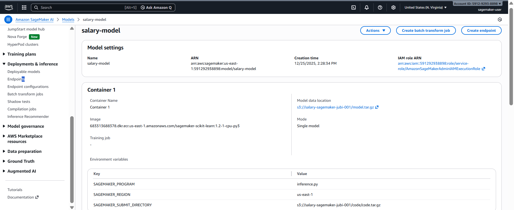
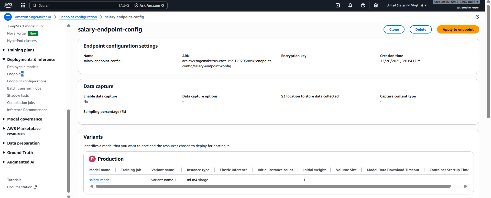

# 📈 Salary Prediction using Amazon SageMaker (Scikit-learn)

This project demonstrates an **end-to-end Machine Learning deployment pipeline** using **Amazon SageMaker**.  
A **Linear Regression model** is trained locally using Scikit-learn, packaged as artifacts, uploaded to **Amazon S3**, and deployed as a **real-time HTTPS endpoint** on SageMaker for inference.

The deployed endpoint predicts **salary based on years of experience**.

--- 

### 📸 Project Architecture


---

## 🚀 Project Objective

- Train a regression model locally
- Package model and inference logic
- Deploy model using Amazon SageMaker
- Expose the model as a real-time endpoint
- Perform predictions using AWS SDK (`boto3`)

---

## 🧠 Model Overview

- **Algorithm**: Linear Regression
- **Framework**: Scikit-learn
- **Use Case**: Salary prediction
- **Input Feature**: `YearsExperience`
- **Output**: Predicted `Salary`

---

## 📊 Model Training (Local)

The model is trained locally using Scikit-learn.

### Training Highlights
- Dataset loaded from CSV
- 90% training, 10% testing split
- Model evaluation using **R² Score**

**Result:**
R² Score: 0.99998
This confirms an excellent fit for the dataset.

The trained model is serialized using `joblib` and saved as:
model.pkl


---

## 🧩 Inference Logic (inference.py)

The inference script defines how SageMaker:
- Loads the model
- Parses incoming requests
- Runs predictions
- Formats responses

### Functions Implemented
- `model_fn()` – loads `model.pkl`
- `input_fn()` – parses JSON input into a DataFrame
- `predict_fn()` – runs model prediction
- `output_fn()` – returns JSON response

This script is used by the SageMaker container at runtime.

---

## 📦 Model & Code Packaging

The artifacts are packaged as required by SageMaker.

### Model Artifact
model.tar.gz

Contains:
- `model.pkl`

### Code Artifact
code.tar.gz

Contains:
- `inference.py`

These archives are uploaded to Amazon S3.

---

## ☁️ Amazon S3 Storage

### Model Artifact Location
Contains:
- `inference.py`

These archives are uploaded to Amazon S3.

---

## ☁️ Amazon S3 Storage

### Model Artifact Location
s3://salary-sagemaker-jubi-001/model.tar.gz


### Inference Code Location
s3://salary-sagemaker-jubi-001/code/code.tar.gz


S3 acts as the **single source of truth** for deployment artifacts.

---

## 🧠 SageMaker Model Creation

A SageMaker **Model** is created using:

- **Container Image**  
683313688378.dkr.ecr.us-east-1.amazonaws.com/sagemaker-scikit-learn:1.2-1-cpu-py3

  
- **Model Data**  
s3://salary-sagemaker-jubi-001/model.tar.gz


- **Environment Variables**
| Key | Value |
|----|------|
| `SAGEMAKER_PROGRAM` | `inference.py` |
| `SAGEMAKER_REGION` | `us-east-1` |
| `SAGEMAKER_SUBMIT_DIRECTORY` | `s3://salary-sagemaker-jubi-001/code/code.tar.gz` |

---

### 📸 Screenshot – SageMaker Model Creation



---

## ⚙️ Endpoint Configuration

An **Endpoint Configuration** defines:
- Instance type
- Number of instances
- Traffic routing

### Configuration Used
- **Instance Type**: `ml.t2.medium`
- **Variant Type**: Production variant
- **Initial Instance Count**: 1

---

### 📸 Screenshot – Endpoint Configuration



---

## 🌐 Endpoint Deployment

Using the endpoint configuration, a **real-time SageMaker endpoint** is created.

### Endpoint Name
salary-endpoint


Once deployed:
- Endpoint exposes an HTTPS API
- Automatically scales and manages infrastructure
- Ready for real-time inference

---

### 📸 Screenshot – SageMaker Endpoint (InService)


---

## 🔮 Performing Predictions

Predictions are made using the **SageMaker Runtime API** via `boto3`.

### Sample Input
```json
{
  "YearsExperience": [1.5, 3, 5, 8]
}
```
### Invocation Flow

- Client sends JSON payload
- SageMaker routes request to container
- inference.py processes input
- Model generates predictions
- JSON response returned

## 🏁 Conclusion

This project successfully demonstrates how a locally trained Scikit-learn model can be deployed to AWS SageMaker and served as a production-ready inference endpoint.
